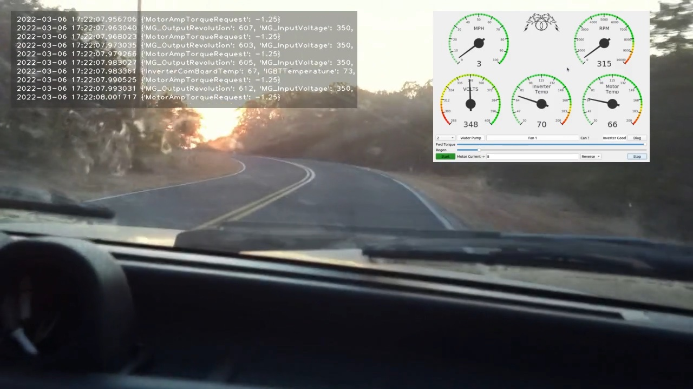
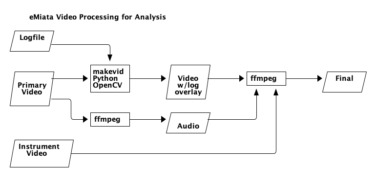

eMiata Video Processing
=======================

Notes about how to process eMiata videos for vehicle analysis.

To help analyze and tune vehicle performance, we need to combine several data
sources into a single video. The inputs are:

* primary video from GoPro, with audio
* instrument panel video
* text log file

The output of this process should be the primary video, including audio, with
an overlay panel showing scrolling log message synchronized in time with the
primary video, and the instrument panel overlay.  Here is a frame from a proof-
of-concept video:





The video processing program is Python and makes use of
[opencv-python](https://github.com/opencv/opencv-python) to access the opencv
processing library.

For the purposes of this discussion, the processing program will be called
`makevid`.

Inputs and Outputs
------------------

### Logfile

The logfile is timestamped lines of text. It looks like this:

```
2022-03-06 17:22:07.000784 {'MotorAmpTorqueRequest': 10.0}
2022-03-06 17:22:07.003265 {'MG_OutputRevolution': 661, 'MG_InputVoltage': 350, 'MG_EffectiveTorque': 8.5}
2022-03-06 17:22:07.012430 {'MotorAmpTorqueRequest': 10.0}
2022-03-06 17:22:07.013301 {'MG_OutputRevolution': 658, 'MG_InputVoltage': 350, 'MG_EffectiveTorque': 10.0}
2022-03-06 17:22:07.023291 {'MG_OutputRevolution': 659, 'MG_InputVoltage': 350, 'MG_EffectiveTorque': 9.5}
2022-03-06 17:22:07.024248 {'MotorAmpTorqueRequest': 9.0}
2022-03-06 17:22:07.033299 {'MG_OutputRevolution': 656, 'MG_InputVoltage': 350, 'MG_EffectiveTorque': 11.0}
2022-03-06 17:22:07.035948 {'MotorAmpTorqueRequest': 9.0}
```

The text timestamp at the beginning of each line can be read and coverted into
a unix time stamp of seconds and microseconds. The `makevid` program will take
the first line of the log file as the time origin for the video, and use that
as an offset for all remaining time stamps in the file.

`makevid` will process video frames, keeping track of the time. Whenever the
video time is equal or greater than the timestamp on a line in the log file,
that line will be added to the text log overlay panel in the video.

If the log file runs out of lines before the end of the video, then no new
lines are added to the panel. A message is added to the panel indicating end
of log.

**TODO** future feature is to use a command line option to specify the log
file time offset.

### Primary Video


The primary video comes from a video camera such as a GoPro, and includes
audio of the environment. The audio may include people talking and vehicle
sounds.

Because the `makevid` processing program does not include audio, _ffmpeg_ is
used to extract the audio from the original video, to be recombined later.

The primary video feeds into the `makevid` program where it is overlaid with
log data text.

### Instrument Video

The instrument video show the instrument panel (dials, gauges, readouts, etc).
It is overlaid onto the final video using *ffmpeg*.

### Final Video

The final video comes from 3 inputs. First, the original video with the
overlaid test log file. This video no longer has audio. The second input is
the instrument panel video. Finally, the original audio is also recombined.
These inputs are all combined using *ffmpeg* to produce the final video with
all overlays, and audio.

Processing Tools
----------------

### makevid

`makevid` is a Python program (this is a placeholder name for now). It uses
`python-opencv` to make use of the video frame processing library to add log
file text in an overlay window.

The input is the original driving video and a text log file. The program reads
in video frames and keeps track of the time position in the video. It compares
the video time to the time stamp of lines in the log file. When the video frame
time is the same or greater than the time stamp of the line in the log file, it
will add the line to a text window overlay. This may result in multiple lines
being added in a single frame.

The lines in the log file have a wall clock timestamp. This needs to be
synchronized with the time of the video. I see three ways to handle this:

1. assume they both start at the same time and compute an offset based on the
   time stamp of the first line in the file
2. allow the user to specify the offset
3. assume the video file metadata accurately reflects the start time of the
   video and use that to compute an offset to synchronize with the log file.

Ultimately, `makevid` should have a command line and/or a configuration file
to let the user specify input and output files, sync method, and other features
such as position and size of overlays, transparency, etc.

### ffmpeg

This is an off-the-shelf open source program for processing video. It excels
at tasks related to processing, separating, combining, and transcoding video.
It can handle changes in frame rate as well.

It is possible that the instrument video and the primary video do not have the
same frame rate. Ffmpeg will handle this when the instrument video is combined
into the output. The ffmpeg combining stage is also the place where the size
and quality of the final video can be adjusted.

### Process Wrapper

There will be an as-yet unnamed script or program that will be used to wrap the
entire process, hiding the separate stages from the user. This could be another
Python program, a shell script, or a Makefile.

Discussion of Approaches
------------------------

The approach described above was determined based on experimentation to be the
easiest to quickly get something working. The main drawbacks of OpenCV are that
it is really meant for more sophisticated image processing such as motion
detection so it might be overkill for this task. Also, it does not handle
audio. Finally, the font choices are a limited set of simple vector fonts, so
we lose the ability to choose a nice looking fixed pitch font, or to make font
adjustments for easier on-screen reading.

Another tool that was considered is `pymovie`. This lets you process video and
do things like composite overlays. It can probably be made to work as well, but
I was not able to get a suitable result as quickly or simply as using OpenCV.
Further, `pymovie` seems to re-encode the output without any programmer control
over the encoder.

Another approach is to use an imaging tool like Pillow or Imagemagick to
programatically generate the text overlay as a sequence of images. These can
then be later converted into video and combined as an overlay using ffmpeg.
This would allow more control over the text appearance. However, the
intermediate files would use a lot of disk space during the process.
