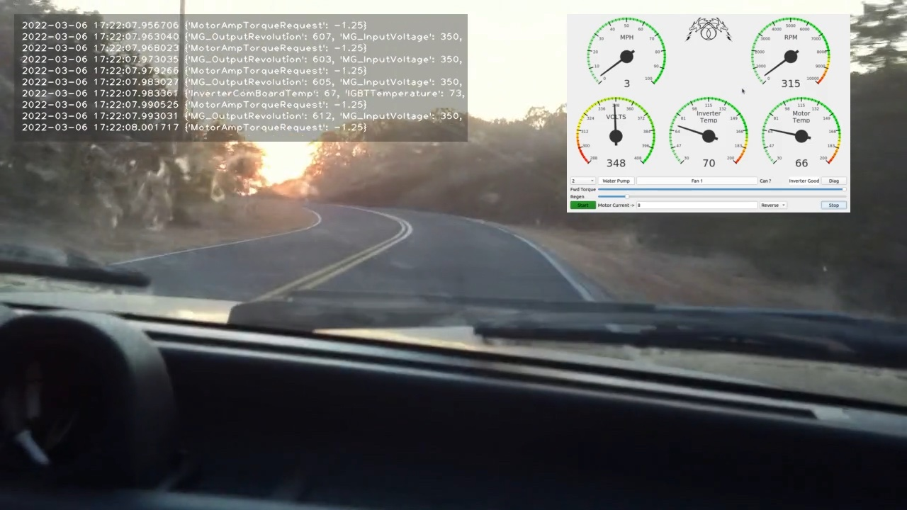
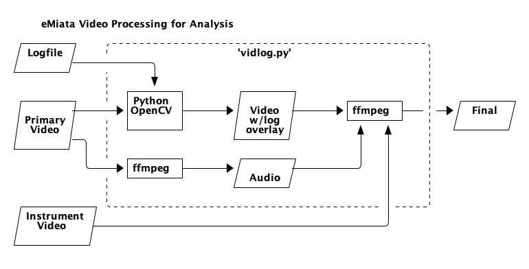

eMiata Video Processing
=======================

`vidlog.py` - tool to process eMiata video and instrumentation

**LICENSE:** The license for this project is the
[MIT License](https://opensource.org/licenses/MIT).

To help analyze and tune vehicle performance, we need to combine several data
sources into a single video. The inputs are:

* primary video from GoPro, with audio
* instrument panel video
* text log file

The output of this process is the primary video, including audio, with
an overlay panel showing scrolling log message synchronized in time with the
primary video, and the instrument panel overlay.  Here is a frame from a proof-
of-concept video:



This is a video processing program written in Python. It makes use of
[opencv-python](https://github.com/opencv/opencv-python) to access the opencv
processing library, and
[ffmpeg-python](https://github.com/kkroening/ffmpeg-python) to make it easy
to process video using ffmpeg.

Here is a diagram showing the data flow:



Installing and Using
--------------------

You should definitely use a virtual environment. You can use the provided
script `setup.sh` to create the virtual environment and install the required
modules and this module in "development" mode. After that you need to activate
the virtual environment. Then you are good to go.

```
./setup.sh
. venv/bin/activate
```

Here are the command line options, and example output:

```
$ vidlog --help

usage: vidlog [-h] [-v] [-q] -i INPUT -l LOGFILE -d DASH [-o OUTPUT] [-t DURATION] [-ss START] [--bad-gps]
              [--check-timestamps]

eMiata Video Processor

optional arguments:
  -h, --help            show this help message and exit
  -v, --verbose         turn on extra output
  -q, --quiet           silence all output
  -i INPUT, --input INPUT
                        input video file
  -l LOGFILE, --logfile LOGFILE
                        input log text file
  -d DASH, --dash DASH  input dash instruments video cap
  -o OUTPUT, --output OUTPUT
                        output video file (default=processed.mp4)
  -t DURATION, --duration DURATION
                        duration in seconds
  -ss START, --start START
                        start position in seconds
  --bad-gps             dont use GPS for time, use file time instead
  --check-timestamps    check file timestamps and exit
```

Example that processes 15 seconds of video starting at 80 seconds from the
beginning:

```
$ vidlog --input test_clip.mov --logfile test_log.txt --dash vokoscreen.mp4 -ss 80 -t 15
Opening video test_clip.mov for overlay processing.
Seconds processed |████████████████████████████████| 15/15

Finished creating text overlay
Processing dash instruments file vokoscreen.mp4
Finished processing dash instruments
```

**Note:** for high resolution video, the dash processing step can take a long
time. Possibly more than 1 second per second of input. There is no on-screen
progress indicator, but if you use `--verbose` you can see the progress
indication from ffmpeg.

To clean up you can just delete the virtual environment. But be sure to
deactivate first:

```
$ deactivate
$ rm -rf venv
```

Inputs and Outputs
------------------

### Logfile

The logfile is timestamped lines of text. It looks like this:

```
2022-03-06 17:22:07.000784 {'MotorAmpTorqueRequest': 10.0}
2022-03-06 17:22:07.003265 {'MG_OutputRevolution': 661, 'MG_InputVoltage': 350, 'MG_EffectiveTorque': 8.5}
2022-03-06 17:22:07.012430 {'MotorAmpTorqueRequest': 10.0}
2022-03-06 17:22:07.013301 {'MG_OutputRevolution': 658, 'MG_InputVoltage': 350, 'MG_EffectiveTorque': 10.0}
2022-03-06 17:22:07.023291 {'MG_OutputRevolution': 659, 'MG_InputVoltage': 350, 'MG_EffectiveTorque': 9.5}
2022-03-06 17:22:07.024248 {'MotorAmpTorqueRequest': 9.0}
2022-03-06 17:22:07.033299 {'MG_OutputRevolution': 656, 'MG_InputVoltage': 350, 'MG_EffectiveTorque': 11.0}
2022-03-06 17:22:07.035948 {'MotorAmpTorqueRequest': 9.0}
```

The text timestamp at the beginning of each line can be read and coverted into
a unix time stamp of seconds and microseconds.

`vidlog` will process video frames, keeping track of the time. Whenever the
video time is equal or greater than the timestamp on a line in the log file,
that line will be added to the text log overlay panel in the video.

If the log file runs out of lines before the end of the video, then no new
lines are added to the panel. A message is added to the panel indicating end
of log.

### Primary Video

The primary video comes from a video camera such as a GoPro, and includes
audio of the environment. The audio may include people talking and vehicle
sounds.

Because OpenCV does not include audio, the audio from the primary video is
extracted at the beginning of the process, and then re-added at the end after
the overlays have been applied.

The primary video feeds into the `vidlog` program where it is overlaid with
log data text.

### Instrument Video

The instrument video show the instrument panel (dials, gauges, readouts, etc).
It is overlaid onto the final video using *ffmpeg*.

### Final Video

The final video comes from 3 inputs. First, the original video with the
overlaid test log file. This video no longer has audio. The second input is
the instrument panel video. Finally, the original audio is also recombined.
These inputs are all combined using *ffmpeg* to produce the final video with
all overlays, and audio.

Limitations
-----------

The current iteration of this program makes a number of assumptions. All of the
following are meant to be improved in future versions. See the github issues
for a list of TODOs.

**Assumptions**

* (FIXED) the start of the primary video and the log file are the same time
* (FIXED) the log file contains at least as much data as the video duration
* (FIXED) the instrument panel video is the same duration
* the overlay positions and sizes are hard coded
* the overlay properties (text color, bg color, font size, etc)
  are all hard coded

Discussion of Approaches
------------------------

The approach described above was determined based on experimentation to be the
easiest to quickly get something working. The main drawbacks of OpenCV are that
it is really meant for more sophisticated image processing such as motion
detection so it might be overkill for this task. Also, it does not handle
audio. Finally, the font choices are a limited set of simple vector fonts, so
we lose the ability to choose a nice looking fixed pitch font, or to make font
adjustments for easier on-screen reading.

However, OpenCV makes it really easy to do some kind of processing every frame
and so that is how the log text is added for each frame of the video.

Another tool that was considered is `pymovie`. This lets you process video and
do things like composite overlays. It can probably be made to work as well, but
I was not able to get a suitable result as quickly or simply as using OpenCV.
Further, `pymovie` seems to re-encode the output without any programmer control
over the encoder.

Another approach is to use an imaging tool like Pillow or Imagemagick to
programatically generate the text overlay as a sequence of images. These can
then be later converted into video and combined as an overlay using ffmpeg.
This would allow more control over the text appearance. However, the
intermediate files would use a lot of disk space during the process.
